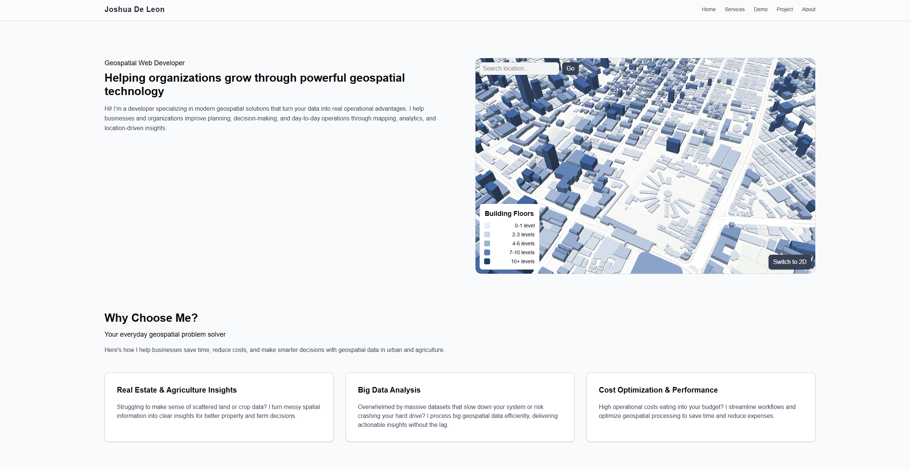

# This is my official website.v1
Check it out: [https://joshdels.topmapsolutions.com/](https://joshdels.topmapsolutions.com/)




### Features
1. Built with Nextjs and Supabase
2. Interactive MapLibre maps
3. Mailbox integration with maps

Im happy for your suggestions

---
## Getting Started
Clone the repository
```
git clone https://github.com/joshdels/supabase-next-ts-my-official-website
```

### Create a .env file with your Supabase credentials:
more of this in the documentation 
https://supabase.com/docs/guides/getting-started/quickstarts/nextjs

```
NEXT_PUBLIC_SUPABASE_URL="YOUR SUPABASE URL"
NEXT_PUBLIC_SUPABASE_PUBLISHABLE_KEY = "YOUR SUPABASE KEY""
```

### Install the neccessary and run after
```
npm install
```

```
npm run dev
```

### Docker Setup for servers setup

```
docker-compose -f docker-compose.prod.yml up -d --build
docker-compose down -v
```

### CI/CD Setup for VPS
1. Generate SSH keys on your local machine
```
ssh-keygen -t rsa -b 4096 -C "github-action" -f github-action-key
```
2. Copy the public key to your server
```
ssh -i github-action-key.pub user@your_server_ip 
```
3. Add the key to authorized keys inside the server
```
ssh user@your_server_ip
cat github-action-key.pub
nano ~/.ssh/authorized_keys
```
4. Set permissions inside the server
```
chmod 700 ~/.ssh
chmod 600 ~/.ssh/authorized_keys
chown root:root /root/.ssh /root/.ssh/authorized_keys
```
5. Add secrets to GitHub Actions (.github/workflows/deploy.yml)
```
SERVER_IP = your server ip
SSH_PRIVATE_KEY  = your ssh_genereated private key
```