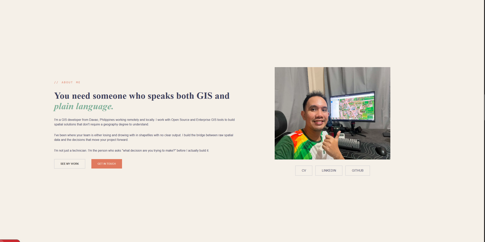

# Porfolio V 2.0

## this is my simple porfolio and it will grow overtime

V1 focus on

- Tailwind
- supabase as backend
- random stuffs such as email
- calendar calendy
- interactive maplibre/osm fetch

V2 focus on

- Land Planning Projects as a GIS Analyst and Developer
- Vanilla CSS for more control and less html bloating
- Django as the backend since it has Admin Panel I can use
- story branding

---

This is a improvment overtime. For employeers and future clients

